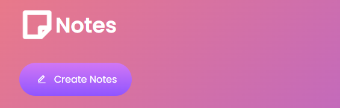
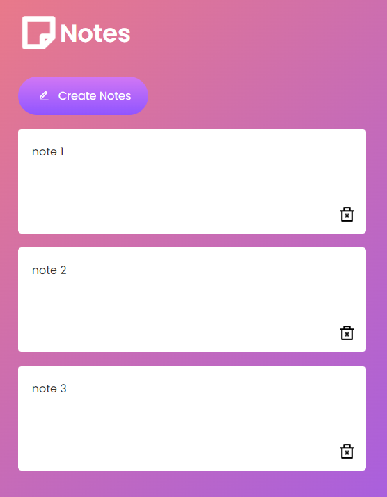

# Notes App README

Welcome to the Notes App project repository! This web application is a versatile tool created using HTML, CSS, and JavaScript. It allows users to create, edit, and organize their notes for improved productivity and organization.

## Table of Contents
- [Introduction](#introduction)
- [Features](#features)
- [Installation](#installation)
- [Usage](#usage)
- [Technologies Used](#technologies-used)
- [Screenshots](#screenshots)
- [Contributing](#contributing)
- [License](#license)

## Introduction
The Notes App is a project developed by Thembi as part of your journey in upskilling in web development. It offers a straightforward and effective way for users to take and manage notes for various purposes, from personal to professional.

## Features
- **Create Notes:** Users can create new notes by entering a title and content.
- **Edit and Delete:** Notes can be edited or deleted as needed.
- **Organize:** Notes are organized in a list view for easy access.

## Installation
To run the Notes App locally, follow these steps:

1. Clone this repository:
   ```
   git clone https://github.com/your-username/notes-app.git
   ```

2. Navigate to the project directory:
   ```
   cd notes-app
   ```

3. Open the `index.html` file in your preferred web browser.

## Usage
1. Open the app in your browser.
2. To create a new note, click the "New Note" button.
3. Enter a title and the content of your note.
4. Click the "Save" button to save the note.
5. To edit or delete a note, click the corresponding buttons in the note list.
6. Use the search bar to find specific notes by keywords.

## Technologies Used
- HTML5
- CSS3
- JavaScript
- Local Storage (for data persistence)

## Screenshots
[Live Demo](https://notes-app-ngww.vercel.app)




## Contributing
Contributions to the Notes App project are welcome! If you have ideas for new features or improvements, please feel free to create a pull request. Ensure that your contributions align with the project's goals.

## License
This project is licensed under the [MIT License](LICENSE).

---

Thank you for exploring the Notes App! It's a versatile tool for keeping track of your thoughts and tasks. If you have any questions or suggestions, feel free to contact me via twitter at @ngwcodes. Enjoy taking and managing your notes!